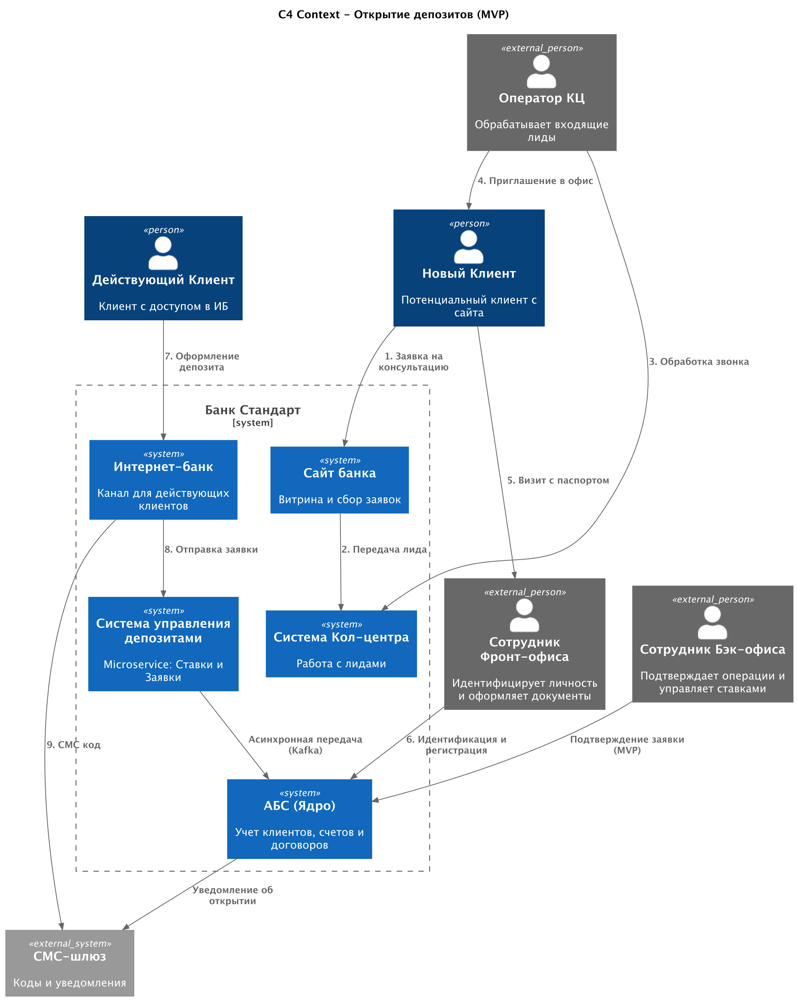
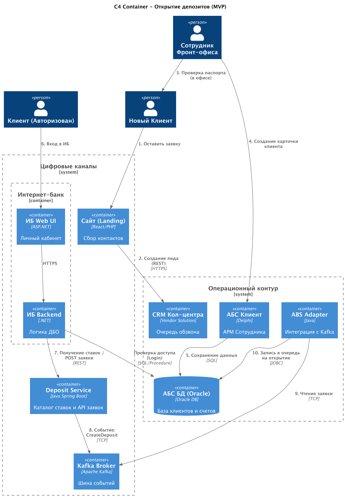

### **Название задачи:** Цифровая трансформация процесса открытия депозитов (MVP)
### **Автор:** Кулаев Р.
### **Дата:** 2025.12.08
### **Функциональные требования**

| **№** | **Действующие лица или системы**          | **Use Case**                             | **Описание**                                                                                                                                                          |
|:-----:|:------------------------------------------|:-----------------------------------------|:----------------------------------------------------------------------------------------------------------------------------------------------------------------------|
|   1   | Новый Клиент, Сайт                        | Просмотр витрины депозитов               | Клиент заходит на сайт, видит список депозитов и процентные ставки. Данные подтягиваются из «Каталога продуктов».                                                     |
|   2   | Новый Клиент, Сайт, КЦ                    | Подача заявки (Lead)                     | Клиент оставляет ФИО и телефон. Заявка сохраняется и передается в CRM Кол-центра для прозвона.                                                                        |
|   3   | Новый Клиент, Сотрудник Фронт-офиса, АБС  | Идентификация и открытие счета (Офлайн)  | Клиент приходит в отделение с паспортом. Сотрудник идентифицирует личность, заводит карточку клиента в АБС, подписывает договор ДБО и выдает доступ к Интернет-банку. |
|   4   | Действующий Клиент, Интернет-банк (ИБ)    | Просмотр персональных условий            | Клиент авторизуется в ИБ. Система показывает доступные депозиты с учетом персональных надбавок (если есть).                                                           |
|   5   | Действующий Клиент, ИБ, СМС-шлюз          | Открытие депозита (Заявка)               | Клиент выбирает счет списания, сумму и срок. Подтверждает действие СМС-кодом. Заявка отправляется в банк.                                                             |
|   6   | Сотрудник Бэк-офиса, АБС                  | Обработка заявки (MVP)                   | Сотрудник видит заявку в интерфейсе АБС, проверяет её и подтверждает открытие (проводку) депозита.                                                                    |
|   7   | АБС, СМС-шлюз                             | Уведомление об открытии                  | После подтверждения сотрудником, АБС инициирует отправку СМС клиенту: «Депозит открыт, ставка X%».                                                                    |
|   8   | Сотрудник Бэк-офиса                       | Управление ставками                      | Сотрудник загружает актуальные ставки в новый сервис (вместо рассылки Excel-файлов), чтобы они отобразились на Сайте и в ИБ.                                          |

### **Нефункциональные требования**

| **№** | **Требование**                                                                                                                                                     |
|:-----:|:-------------------------------------------------------------------------------------------------------------------------------------------------------------------|
|   1   | **Надежность:** Асинхронная обработка заявок. Временная недоступность АБС не должна блокировать прием заявок в ИБ/на Сайте.                                        |
|   2   | **Производительность:** Отображение списка депозитов и ставок на клиенте < 500 мс. Снятие нагрузки на чтение («холодные данные») с АБС.                            |
|   3   | **Безопасность:** Шифрование канала (TLS) и данных заявок. Использование СМС для подписи операций.                                                                 |
|   4   | **Поддерживаемость:** Использование микросервисного подхода для нового функционала (Java Spring Boot), чтобы снизить зависимость от релизных циклов подрядчика ИБ. |
|   5   | **Масштабируемость:** Возможность горизонтального масштабирования сервиса приема заявок при росте нагрузки.                                                        |

### **Решение**

Для реализации требований выбрана гибридная архитектура, включающая создание нового микросервиса Deposit Service и использование шины событий Kafka для интеграции с устаревшими системами (Legacy).

Основные компоненты решения:
1. **Deposit Service (Java Spring Boot + PostgreSQL):**
- Централизованный мастер-системой для хранения условий продуктов (ставок) и временного хранения принятых заявок.
- Реализует REST API для Сайта и Интернет-банка.
- Позволяет быстро отдавать данные на фронт, не нагружая АБС.
2. **Apache Kafka:**
- Выступает буфером между быстрым цифровым слоем (ИБ/Сайт) и медленным транзакционным ядром (АБС).
- Обеспечивает гарантированную доставку заявок, даже если АБС временно недоступна или перегружена.
3. **Интернет-банк (.NET Legacy):**
- Дорабатывается минимально. Реализуется фасад/адаптер для вызова API Deposit Service.
- Использует существующий модуль СМС-подтверждения.
4. **АБС (Oracle):**
- Реализуется Consumer (слушатель) Kafka (на Java или через коннектор), который забирает заявки и создает их в таблицах АБС для ручной обработки сотрудниками (MVP стадия).
Логика выбора технологий:
1. **Java Spring Boot:** Стандарт де-факто для микросервисов, есть экспертиза в команде банка (отдел АБС/КЦ имеет опыт с Java).
2. **PostgreSQL:** Надежная, бесплатная СУБД, совместимая со стандартами банка.
3. **Kafka:** Выбрана "на перспективу" и для решения проблемы бутылочного горлышка АБС (требование задания). Позволяет развязать системы.

### **Альтернативы**

1. Прямая синхронная интеграция (ИБ -> АБС DB Link):
- Описание: ИБ пишет заявки напрямую в таблицы Oracle АБС.
- Причина отказа: Высокий риск блокировок БД АБС, создание жесткой связности, невозможность масштабирования при росте числа заявок. Нарушает требование "Не перегружать АБС".
2. Реализация логики ставок внутри монолита Интернет-банка:
- Описание: Подрядчик дорабатывает .NET код и создает таблицы ставок в MS SQL.
- Причина отказа: Зависимость от подрядчика, дорого и долго. Банку стратегически важно накапливать экспертизу внутри (Java).
3. Использование RabbitMQ вместо Kafka:
- Описание: Использование классического брокера сообщений.
- Причина отказа: В задании явно указано предпочтение Kafka "на перспективу". Kafka лучше подходит для Event Sourcing и высокой пропускной способности логов событий.

**Недостатки, ограничения, риски**

- Ручное узкое место (MVP): В первой версии процесса (MVP) сохраняется необходимость участия сотрудника бэк-офиса для финального подтверждения в АБС. При резком наплыве онлайн-заявок сотрудники могут не успевать их обрабатывать (риск увеличения времени открытия депозита).
- Сложность инфраструктуры: Внедрение Kafka и Kubernetes/Docker для нового микросервиса требует усилий от DevOps команды и настройки мониторинга.
- Согласованность данных: Клиент может увидеть в ИБ статус "Заявка отправлена", но в АБС она появится с задержкой (миллисекунды или минуты). Необходимо корректно обрабатывать UI состояния.
- Интеграция Legacy: Потребуется написать адаптер на стороне ИБ (.NET), который умеет работать с REST API нового Java-сервиса. Это требует координации внутренней команды и внешнего подрядчика.

