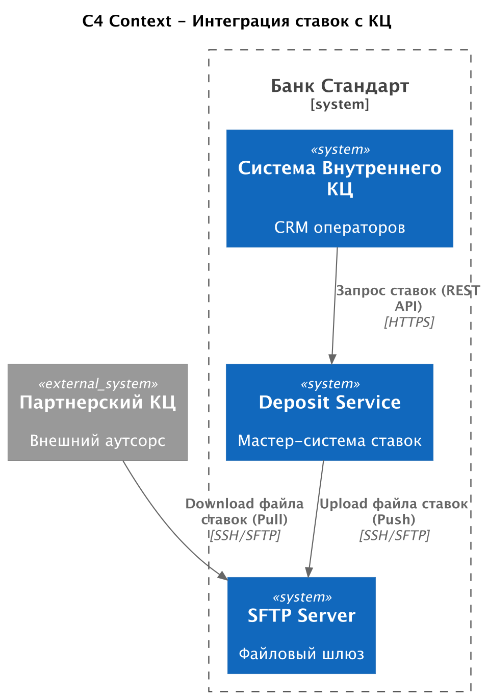
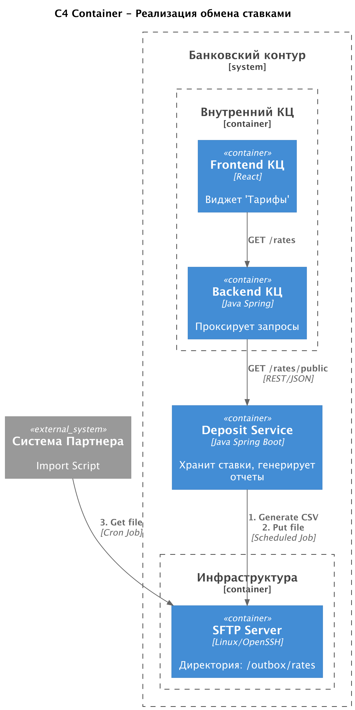

### **Название задачи:** Обеспечение доступа к актуальным депозитным ставкам для внутреннего и партнерского кол-центров
### **Автор:** Кулаев Р.
### **Дата:** 2025.12.09
### **Функциональные требования**

| **№** | **Действующие лица или системы**        | **Use Case**                | **Описание**                                                                                                                   |
|:-----:|:----------------------------------------|:----------------------------|:-------------------------------------------------------------------------------------------------------------------------------|
|   1   | **Оператор внутреннего КЦ**, Система КЦ | Просмотр справочника ставок | Оператор в интерфейсе CRM открывает виджет "Депозиты" и видит актуальную таблицу ставок, полученную из мастер-системы.         |
|   2   | **Deposit Service**, SFTP-сервер        | Экспорт ставок в файл       | При обновлении ставок (или по расписанию) сервис формирует файл (CSV/XLSX) и загружает его в защищенную папку на SFTP-сервере. |
|   3   | **Партнерский КЦ**, SFTP-сервер         | Получение ставок (Файл)     | Внешняя система партнера забирает файл с SFTP, парсит его и обновляет скрипты/интерфейсы своих операторов.                     |
|   4   | **Администратор Банка**                 | Управление доступом         | Настройка прав доступа для партнера к конкретной директории SFTP.                                                              |

### **Нефункциональные требования**

| **№** | **Требование**                                                                                                                                                                            |
|:-----:|:------------------------------------------------------------------------------------------------------------------------------------------------------------------------------------------|
|   1   | **Актуальность данных:** Внутренний КЦ должен получать данные в режиме реального времени (Request/Response). Партнерский КЦ — с задержкой не более 1 часа после утверждения новых ставок. |
|   2   | **Безопасность:** Передача файлов партнеру только через защищенный протокол SFTP. Аутентификация партнера по ключу или логину/паролю.                                                     |
|   3   | **Совместимость:** Формат файла для партнера должен быть согласован и фиксирован (например, CSV с разделителем ;), чтобы избежать ошибок парсинга на их стороне.                          |
|   4   | **Отказоустойчивость:** Если SFTP недоступен, Deposit Service должен повторить попытку выгрузки файла позже.                                                                              |

### **Решение**

Для реализации выбрана комбинированная схема интеграции: REST API для внутреннего контура и File Transfer (SFTP) для внешнего партнера. Источником правды выступает микросервис Deposit Service, спроектированный в рамках MVP.

**Основные компоненты и изменения:**
1. **Deposit Service (Java Spring Boot):**
   - Доработка: Реализация публичного эндпоинта GET /api/v1/rates/public для внутреннего КЦ.
   - Доработка: Реализация планировщика, который генерирует файл ставок и отправляет его на SFTP сервер.
2. **Система внутреннего КЦ (CRM):**
   - Доработка: Бэкенд КЦ настраивает проксирование запроса к Deposit Service. Фронтенд (React) добавляет виджет отображения таблицы.
3. **SFTP Server:**
   - Разворачивается в защищенном сегменте сети банка. Служит шлюзом для обмена файлами.

### **Альтернативы**

1. **Отправка ставок по Email (SMTP):**
   - Суть: Сервис отправляет письмо с вложением на адрес партнера.
   - Минусы: Небезопасно, сложно автоматизировать на стороне приема, нет гарантии доставки, риск попадания в спам.
2. **Предоставление доступа партнеру во внутреннюю CRM (VPN):**
   - Суть: Дать учетные записи сотрудникам партнера во внутреннюю систему банка.
   - Минусы: Высокие риски ИБ, сложность настройки VPN для 100 внешних сотрудников, лицензионные ограничения платформы CRM.
3. Использование АБС как источника данных:
   - Суть: Выгружать файлы напрямую из Oracle АБС.
   - Минусы: Противоречит архитектуре разгрузки АБС. Логика ставок переносится в Deposit Service, в АБС ставок может не быть в удобном виде.

**Недостатки, ограничения, риски**

- **Рассинхронизация данных у партнера:** Поскольку обмен файловый и периодический (например, раз в сутки или раз в час), есть риск, что партнер будет консультировать по старым ставкам в течение лага времени.
- **Сложность поддержки формата:** При изменении структуры ставок (например, появление надбавок за промокоды) придется менять структуру CSV файла и согласовывать это с IT-отделом партнера.
