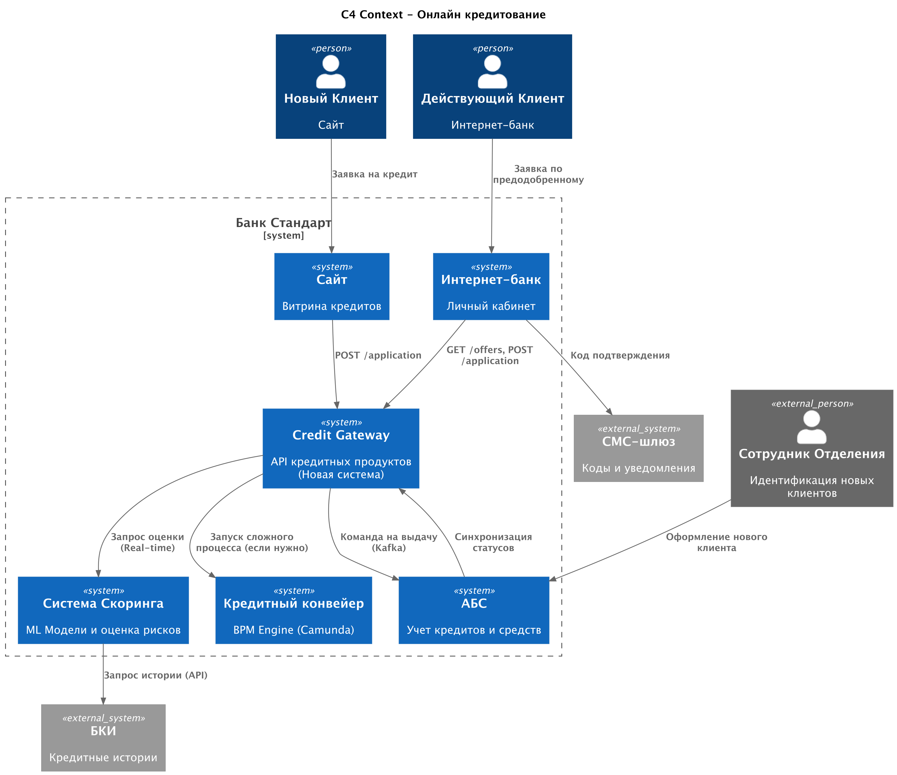
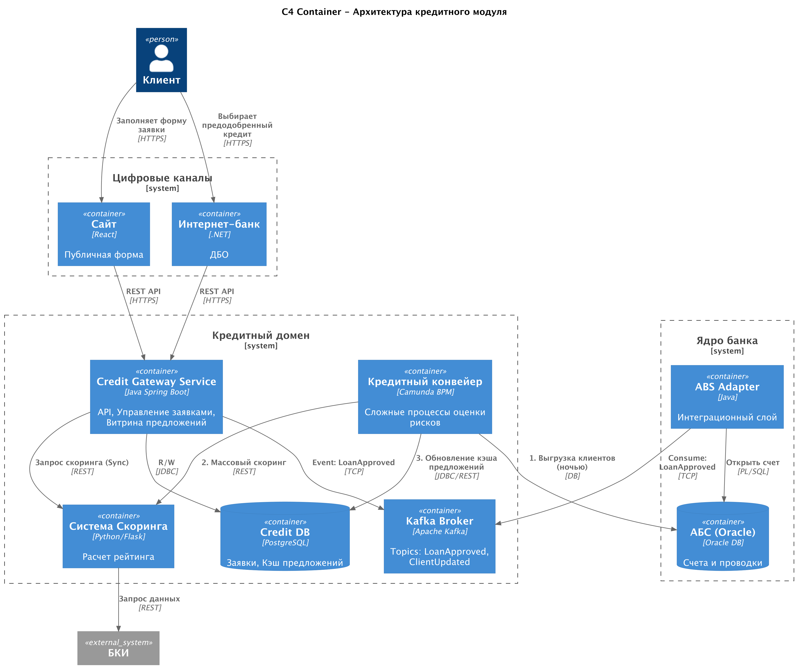

### **Название задачи:** Реализация процесса подачи и обработки заявок на кредит в онлайн-каналах
### **Автор:** Кулаев Р.
### **Дата:** 2025.12.09
### **Функциональные требования**

| **№** | **Действующие лица или системы**       | **Use Case**                        | **Описание**                                                                                                                              |
|:-----:|:---------------------------------------|:------------------------------------|:------------------------------------------------------------------------------------------------------------------------------------------|
|   1   | Новый Клиент, Сайт                     | Подача заявки (Экспресс)            | Клиент заполняет ФИО, телефон и паспортные данные на сайте. Система запрашивает скоринг и сразу выдает предварительное решение.           |
|   2   | Действующий Клиент, Интернет-банк (ИБ) | Просмотр предодобренных предложений | Клиент видит персональные предложения (лимит, ставка), рассчитанные заранее (ночью) на основе истории в банке.                            |
|   3   | Действующий Клиент, ИБ                 | Оформление кредита (онлайн)         | Клиент выбирает предложение, счет зачисления и подтверждает договор СМС-кодом. Кредит выдается автоматически (деньги на счет).            |
|   4   | Credit Service, Scoring System, БКИ    | Онлайн-скоринг                      | При подаче заявки с сайта система в реальном времени запрашивает кредитную историю в БКИ и рассчитывает балл в модели машинного обучения. |
|   5   | Credit Service, АБС                    | Выдача кредита                      | После подтверждения данные передаются в АБС для открытия счета и перечисления средств.                                                    |
|   6   | Новый Клиент, Сотрудник Отделения      | Идентификация и завершение          | После одобрения на сайте клиент приходит в офис. Сотрудник находит заявку в системе, проводит идентификацию и выдает кредит.              |

### **Нефункциональные требования**

| **№** | **Требование**                                                                                                                                             |
|:-----:|:-----------------------------------------------------------------------------------------------------------------------------------------------------------|
|   1   | **Скорость реакции:** Решение по заявке на сайте должно приниматься < 1 минуты (включая запрос в БКИ и работу ML-модели).                                  |
|   2   | **Доступность:** Процесс подачи заявки должен работать 24/7. Зависимость от суточных батчей АБС должна быть исключена для этапа принятия решения.          |
|   3   | **Масштабируемость:** Система должна выдерживать наплыв заявок с сайта без деградации производительности Кредитного конвейера.                             |
|   4   | **Взаимодействие:** Исключить прямую интеграцию Интернет-банка с АБС. Использовать событийную модель (Kafka) для асинхронной выдачи.                       |
|   5   | **Управление нагрузкой:** Тяжелые расчеты предодобренных предложений проводить в часы минимальной нагрузки (ночью), чтобы не замедлять онлайн-выдачу днем. |

### **Решение**

Для реализации требований создается новый слой API - **Credit Gateway Service**, который выступает фасадом для всех онлайн-каналов. Он управляет быстрыми заявками и кэширует предодобренные предложения. Сложная логика процессов остается в **Кредитном конвейере (Camunda)**, а математика — в **Системе Скоринга**.

**Основные архитектурные решения:**
1. **Credit Gateway Service (Java Spring Boot + PostgreSQL):**
   - Новый микросервис. Принимает REST-запросы от Сайта и ИБ.
   - Хранит легкие заявки и статусы.
   - Хранит витрину предодобренных предложений (кеш), чтобы не дергать Скоринг на каждый заход пользователя в ИБ.
2. **Изменение потока данных (Real-time vs Batch):**
   - Раньше: АБС -> (раз в сутки) -> Конвейер -> (раз в сутки) -> Скоринг.
   - Теперь (Онлайн): Сайт -> Gateway -> Скоринг (API) -> БКИ (API). Решение принимается мгновенно.
   - Теперь (Предодобренные): Ночью Job запускает пересчет базы клиентов -> Сохранение результатов в PostgreSQL Gateway сервиса.
3. **Асинхронная выдача (Kafka):**
   - Когда кредит одобрен и подписан СМС-кодом, событие LoanApproved отправляется в Kafka.
   - Адаптер АБС вычитывает событие и создает договор в ядре. Это снимает требование мгновенной доступности АБС в момент нажатия кнопки клиентом.

### **Альтернативы**

1. **Использование существующего Кредитного конвейера (Camunda) как бэкенда для Сайта:**
   - Вариант: Сайт обращается напрямую к API Camunda.
   - Минусы: Camunda — это BPM-движок, он не предназначен для обслуживания высоконагруженного трафика публичного сайта. Лучше поставить перед ним легкий Java-сервис (Gateway).
2. **Реализация логики в Интернет-банке (.NET):**
   - Вариант: ИБ сам ходит в Скоринг и считает предложения.
   - Минусы: Дублирование логики (Сайт на PHP/React, ИБ на .NET). Размазывание критичной бизнес-логики рисков по фронтальным системам.
3. **Синхронная запись в АБС при выдаче:**
   - Вариант: Клиент ждет, пока АБС ответит "ОК".
   - Минусы: Если АБС (Oracle) занята, клиент получит ошибку. Асинхронность через Kafka гарантирует, что заявка принята и будет исполнена, как только АБС освободится.

**Недостатки, ограничения, риски**

- **Риск рассинхронизации предодобренных предложений:** Предложения рассчитываются ночью. Если клиент утром взял кредит в другом банке (и его долговая нагрузка выросла), система может не узнать об этом, если не сделает повторный "легкий" запрос в БКИ перед самой выдачей (легкая проверка). Необходимо предусмотреть финальную проверку.
- **Сложность обработки ошибок (паттерн Saga):** Если кредит одобрен в Gateway, но АБС при обработке сообщения из Kafka вернула ошибку (например, "счет клиента арестован"), необходимо инициировать процесс отмены/компенсации и уведомления клиента.
- **Нагрузка на БКИ:** Реальный онлайн-скоринг с сайта (вероятно) стоит денег за каждый запрос в БКИ. Необходима защита от ботов (Captcha, Rate Limiting) на уровне Credit Gateway.

